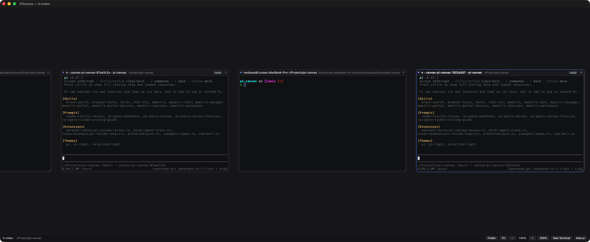
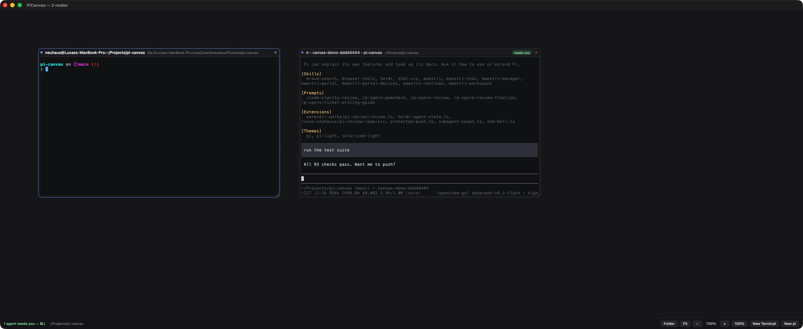

# PiCanvas

A native macOS canvas for coding agents. Zoom around an infinite plane, drop
terminals and `pi` agents anywhere, resize them, delete them.



Every node is a real PTY running a real program — no reimplemented chat UI, no
wrapper around the agent. A `pi` node *is* `pi` in a terminal, so themes, slash
commands, extensions, key bindings and mouse reporting behave exactly as they do
in your terminal. What the canvas adds is the part a terminal grid cannot give
you: knowing which agent wants you, and not losing the conversation when the app
restarts.

## Build and run

```sh
make deps     # fetch vendored sources (SwiftTerm fallback; Ghostty's core)
make ghostty  # build libghostty (needs the Zig toolchain AND Xcode's Metal
              # compiler — see docs/LIBGHOSTTY_STATUS.md)
make app      # build build/PiCanvas.app (uses libghostty when present)
make run      # build and run with logs on stdout
make open     # build and open as a normal app
```

Requirements: macOS 14+, Apple Command Line Tools. **Xcode is not required.**
There is no `.xcodeproj` and no `Package.swift`.

## Appearance follows your Ghostty config

Terminals are not themed by PiCanvas; they are themed by Ghostty's own config.
Keys honoured: `font-family` (first of a fallback list), `font-size`,
`cursor-color`, `cursor-style`, `cursor-style-blink`, `background`,
`foreground`, `selection-background`, `selection-foreground`,
`palette = N=#hex`, `theme = <name>` (resolved from the themes bundled inside
Ghostty.app, or your own themes directory), and `config-file` includes
(including the optional `?` form). Both config locations are read: the XDG one
and `~/Library/Application Support/com.mitchellh.ghostty/config`.

Anything the config does not set falls back to PiCanvas's own dark palette.
One known gap: when a config specifies no colours at all, Ghostty would use its
compiled-in defaults, which are not readable from a file. The libghostty backend
applies them for real; the SwiftTerm fallback uses PiCanvas's dark colours
instead.

What maps where:

| Your config | libghostty backend | SwiftTerm fallback |
| --- | --- | --- |
| font-family / font-size | yes | yes |
| cursor colour / shape / blink | yes | yes |
| background, foreground, selection | yes | yes |
| `palette` (16 colours) | yes | yes |
| `theme = <name>` | yes | yes (from Ghostty's bundled themes) |
| ligatures, `font-thicken` | yes | **no** — SwiftTerm has no equivalent |
| keybinds, shell integration | yes | no (not applicable) |

## Workspaces

A workspace is a named canvas: its own nodes, its own viewport, its own working
directory. `⌘⇧K` lists them; `↵` switches, typing a name offers to create one,
`F2` renames, `⌫` deletes. `⌃⇥` cycles. The current workspace is named in the
status bar, and clicking that name opens the list.

What makes them more than saved layouts: **switching stops nothing.** Agents in
the workspace you leave keep running — same process, same session, still
reporting status. An agent that starts needing you is counted in the status bar
from wherever you are, and `⌘J` will switch to the workspace it is in and take you
there. Nodes in workspaces you have not opened yet are *not* started at all, so
several workspaces cost nothing until you visit them.

Storage is one file per workspace under
`~/Library/Application Support/PiCanvas/workspaces/`. A canvas written by an
earlier version (`layout.json`) is adopted as a workspace named `Default`, and the
old file is left in place so an older build still opens it.

## Ending a node

What happens when a process exits depends on how it exited:

| | behaviour |
| --- | --- |
| You quit `pi` (`/quit`, ctrl-c, ctrl-d) | the node stays and becomes a plain login shell in the same directory |
| A shell exits cleanly (`exit`, ctrl-d) | the node closes itself, and its saved scrollback goes with it |
| A process fails (non-zero, or killed by a signal) | the node stays with `exited 127` / `stopped` in its status pill, so the error is readable |
| You close it (`×`, `⌘W`) | the node and its process go away |

The first two are complementary: quitting an agent leaves you a usable terminal,
and leaving that terminal closes the node.

## Keyboard

| Shortcut | Action |
| --- | --- |
| `⌘T` | New terminal on the canvas |
| `⌘P` | New `pi` agent on the canvas |
| `⌘W` | Close the focused node (falls back to closing the window) |
| `⌘O` | Choose the folder new nodes start in |
| `⌘+` / `⌘-` / `⌘0` | Zoom in / out / actual size |
| `⌘9` | Zoom to fit every node |
| `⌘K` | Go to terminal… — the node switcher |
| `⌘⇧K` | Workspaces… — switch, create, rename, delete |
| `⌃⇥` / `⌃⇧⇥` | Next / previous workspace |
| `F2` | Rename the focused node (or double-click its title bar) |
| `⌘J` | Jump to the next agent that needs you (pans to it if off-screen) |
| `Delete` | Close the selected node (when the canvas, not a terminal, has focus) |
| `⌘C` / `⌘V` / `⌘A` | Copy / paste / select all, routed to the focused terminal |

### Held keys repeat

macOS's press-and-hold accent picker is off for this app, so holding `j` in nvim
moves the cursor instead of offering `ǰ`. Same mechanism Ghostty's own app uses:
a registered `ApplePressAndHoldEnabled = false`, not a persistent write to your
settings. Because registered defaults sit at the bottom of the search order, an
explicit setting of your own still wins — and if that happens the app says so in
the log, with the one-line command to override it.

Mouse: two-finger scroll pans (content follows your fingers, like any other
canvas app), pinch zooms, `⌘`+scroll or `⌥`+scroll zooms, drag a title bar to
move a node, drag **any border or corner** to resize (the cursor changes), click
`×` or anywhere in a node to focus it and raise it.

Scrolling only reaches a terminal when that node is the focused one, and a zoom
gesture always belongs to the canvas — `⌘`/`⌥`+scroll zooms even directly over a
focused terminal, because that is exactly when you want to zoom. `⇧`+scroll is
left to the terminal, which uses it to bypass mouse reporting so you can select
text. Both zoom modifiers are accepted because conventions differ: browsers,
Figma and Preview use `⌘`; Photoshop, Sketch and Maestro use `⌥`.

## Naming a node

Double-click a node's title bar to name it, or press `F2`. Return commits,
Escape cancels, and clicking away commits. Clearing the name hands the title back
to the terminal, which is what it shows when you have not named it — usually the
shell's `user@host:dir`, or `π - <project>` for an agent.

A name you give wins over the terminal's own title for good, so a shell that
announces a new directory does not rename your node out from under you, and it is
what `⌘K` searches — which is the point: name a node `auth refactor` and it stays
findable for as long as it exists.

## Switching between nodes

`⌘K` opens a switcher over the canvas. Type to narrow it, `↑`/`↓` (or `⇥`) to
move, `↵` to go there, `esc` to leave. Rows show the node's title, its directory,
and its agent status.

It matches the title, the directory and the status, so `need` finds the agents
waiting for you, `spero` finds everything in that repo, and `pcn` works as
initials. With nothing typed the order is agents that need you first, then most
recently focused — so `⌘K` `↵` is a two-keystroke switch back to where you were.
The first nine rows are numbered: `⌘K` then `3` selects that row directly, and
typing a digit never filters, so the numbers always mean something.

## Agent awareness

Each `pi` node is bound to its own session before it launches, by passing
`pi --session-id <uuid>`. Sessions are deliberately left **unnamed**: a name in
pi's session list is yours to give, and auto-generated ones make the list harder
to read.

**Restarts do not lose conversations.** Relaunch PiCanvas and each node reopens
the session it owned, transcript and context intact. Two agents working in the
same directory stay separate.

**A node can tell you what it is doing.** pi writes one JSON object per line to
its session file as work completes, so the last entry is a precise status
signal:

| Last transcript entry | Node shows |
| --- | --- |
| no transcript yet | `ready` (pi is at the prompt) |
| `user` message | `thinking` |
| `assistant` with `stopReason: toolUse` | the tool being run, e.g. `bash` |
| `toolResult` | still working, labelled with the tool |
| `assistant` with `stopReason: stop` | **`needs you`** |



When a node lands on `needs you` it is counted in the status bar (`1 agent needs
 you — ⌘J`) and, if PiCanvas is not the active app, the Dock icon bounces once.
`⌘J` cycles through the nodes that want a human, panning to bring them on screen.
That is the whole notification design: a busy canvas stays quiet, and a finished
one gets a nudge. Nothing is shown for `thinking` or tool states, because those
do not need a human.

## Scrollback

Shell nodes also survive a restart visually: on quit each node's terminal buffer
is snapshotted to `~/Library/Application Support/PiCanvas/scrollback/<node>.txt`
(capped at 256 KB, trailing blank rows trimmed) and painted back before the new
shell starts. The restored text is plain — no colours — because it comes from the
buffer rather than the raw byte stream; the live session below it is fully
coloured as usual. `pi` nodes are skipped on purpose: pi redraws its own
transcript from the session file, and injecting an old TUI frame would be noise.

A `kill` behaves like quitting: `SIGTERM` and `SIGINT` are turned into a normal
termination so the layout and snapshots are written rather than lost.

## How it works

```
Sources/PiCanvas/
  main.swift                    entry point, flag handling
  App/
    AppDelegate.swift           window, menus, launch arguments
    CanvasController.swift      node lifecycle: create/restore/close/persist
    MainView.swift              canvas + status bar
    SelfTest.swift              headless integration tests (--self-test)
    PreviewHarness.swift        offscreen render harness (--render-preview)
  Canvas/
    CanvasView.swift            infinite pan/zoom plane, world↔screen maths
    NodeFrameView.swift         node chrome: title bar, close, resize, status pill
  Agent/
    AgentContent.swift          the seam between canvas and terminal
    TerminalContent.swift       SwiftTerm PTY host (the only SwiftTerm importer)
    ProcessResolver.swift       what to launch, with what environment
    PiSessionWatcher.swift      tails the transcript, derives agent status
    TerminalContentFactory.swift
  Model/
    AgentModel.swift            NodeSpec / LayoutFile
    LayoutStore.swift           debounced atomic JSON persistence
    ScrollbackStore.swift       per-node terminal snapshots between launches
```

### Three design decisions worth knowing

**Zoom scales glyphs; resizing changes content.** Canvas zoom multiplies the
terminal font size, so zooming out makes nodes smaller *and* their text smaller —
the whole canvas becomes a readable map instead of a grid of fixed-size text in
shrinking boxes. Node chrome scales with it, clamped so title bars stay usable.
Because the font and the node's pixel size scale together, the grid (columns ×
rows) stays essentially constant while zooming; changing how much content a node
shows is what resizing it is for.

The alternative — a `CALayer` transform — would be two lines of code and would
scale a bitmap, making text mushy. Scaling the *font* keeps every glyph rendered
natively at its true size, so it stays crisp at 20% and at 300%.

**The canvas never imports the terminal library.** `AgentContent` is the seam;
`TerminalContentFactory` is the only place that knows the terminal exists. That
keeps the canvas, the interaction model and persistence testable without a PTY.

**The transcript is the status API.** `PiSessionWatcher` only reads files pi
already writes, so node status needs no hooks, no RPC and no cooperation from
the agent. It reproduces pi's session-directory slug exactly, including
`realpath` resolution (pi turns `/tmp` into `--private-tmp--`).

### Why swiftc instead of SwiftPM

On a Command Line Tools-only install, this machine's `libPackageDescription.dylib`
exports no `Package` symbols, so *every* `swift build` fails with
`Invalid manifest ... Undefined symbols`. `scripts/build-app.sh` therefore drives
`swiftc` directly, and `scripts/build-swiftterm.sh` turns the vendored SwiftTerm
sources into `libSwiftTerm.a` plus a `SwiftTerm.swiftmodule` — including running
SwiftTerm's real build-info generator to produce the files its build plugin
normally emits. This is not a workaround we are waiting to remove: it is faster
to iterate on and has no external moving parts.

## Testing

```sh
# 249 checks: coordinate maths, zoom anchoring, drag, resize from every border,
# delete, renaming, workspaces (migration, keep-alive, lazy start, per-workspace
# viewports, CRUD), persistence round-trip, process launch, session binding, exit
# behaviour, scroll and zoom-scroll routing, key repeat, switcher ranking, the
# agent status state machine, the needs-you indicator and jump, scrollback
# snapshot/restore, zoom-vs-resize behaviour, Ghostty config parsing, and three
# real-PTY tests
./build/PiCanvas.app/Contents/MacOS/PiCanvas --self-test

# Render a window with two nodes to PNG without a display server
./build/PiCanvas.app/Contents/MacOS/PiCanvas --render-preview /tmp/preview.png

# Screenshot just the app window (needs Screen Recording permission)
./scripts/window-shot.sh /tmp/window.png

# Launch with nodes already open, with a palette showing, or mid-rename
./build/PiCanvas.app/Contents/MacOS/PiCanvas --new-terminal --new-pi
./build/PiCanvas.app/Contents/MacOS/PiCanvas --show-palette --palette-query=need
./build/PiCanvas.app/Contents/MacOS/PiCanvas --show-workspaces
./build/PiCanvas.app/Contents/MacOS/PiCanvas --new-pi --rename
```

The self-test synthesises real `NSEvent`s to drive the actual drag and resize
code paths, spawns real PTYs to verify that input reaches the shell, output comes
back, resizing reflows the grid and terminating reaps the process, and tails a
synthetic pi transcript to verify every status transition. It needs no human and
no visible window.

Selected output:

```
terminal round trip (real PTY)
  ok   a login shell starts and writes a prompt
  ok   PTY received a sane column count (102)
  ok   typed input reaches the shell and output comes back
  ok   terminate() reaps the process

resize reflow (real PTY)
  ok   growing the node gives the PTY a bigger grid (69x21 → 138x42)
  ok   shrinking the node reduces the grid (138 → 56)
  ok   zooming out shrinks the glyphs (12.5pt → 6.25pt)
  ok   zooming out keeps roughly the same content (cols 138 → 130)

pi agent status watcher
  ok   session directory resolves symlinks the way pi does
  ok   a user message means the agent is working
  ok   a pending tool call names the tool (got bash)
  ok   a finished run means the agent needs you

agent attention and jump
  ok   only the finished agent asks for attention (got 1)
  ok   the running node names the tool it is using
  ok   jump pans to bring an off-screen node into view
  ok   the target node is on screen after the jump

scrollback persistence (real PTY)
  ok   capping starts at a line boundary
  ok   the snapshot holds the session output
  ok   restored lines start at column 0 (no staircase)
  ok   a restored terminal still runs a shell
```

## State

Canvas layout lives at
`~/Library/Application Support/PiCanvas/layout.json`: node positions, sizes,
kind, working directory, the exact argv to relaunch and the pi session id, plus
viewport zoom and pan. Terminal snapshots live beside it in `scrollback/`.
Writes are debounced and atomic. On launch every node is recreated with its
process restarted, its agent conversation resumed, and shell scrollback
restored.

`PI_*` environment variables are stripped before spawning, so a `pi` node started
from inside another `pi` session does not inherit that session's identity. If
PiCanvas is force-quit, the child processes die with the pty.

## Not built yet

- Cost and token history over time (the transcript already carries `usage`; only
  the current totals are shown)
- Node kinds other than terminals: images, text labels, notes, a browser
- Node connections, drag-to-snap, a minimap
- A first-run welcome state instead of an empty canvas
